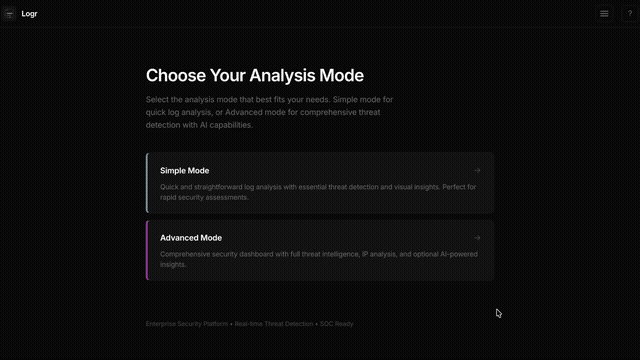
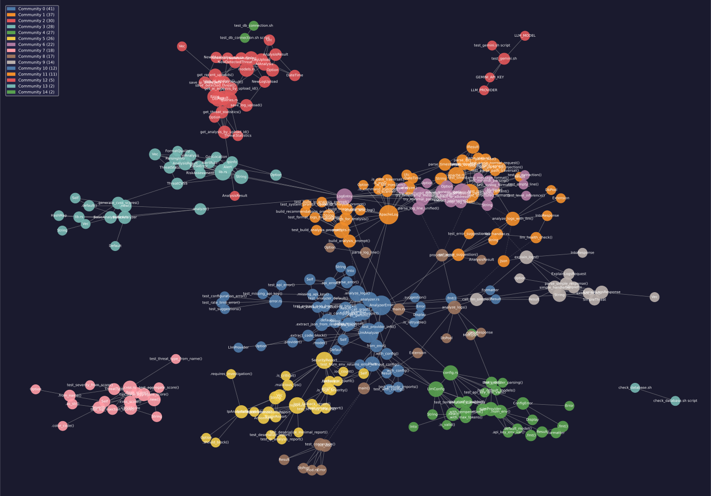

# Security Log Analyzer

[](https://www.rust-lang.org/)
[](LICENSE)
[](https://www.first.org/cvss/)

Production-grade security log analysis platform with dual-mode operation: Simple Mode for beginners and Advanced Mode for security professionals. Built with Rust for performance and reliability.

**Developer:** [Sena Raufi](https://github.com/Senaraufi)

## Demo



## Features

### Analysis Modes

**Simple Mode** - For beginners, students, and small businesses
- Paste logs directly into the interface
- Plain English explanations of security threats
- Risk score with color-coded severity (0-10 scale)
- Actionable remediation steps with commands
- No technical expertise required

**Advanced Mode** - For security professionals
- File upload with batch processing
- CVSS 3.1 scoring for all threats
- Detailed threat statistics and IP analysis
- MITRE ATT&CK framework mapping
- Database integration for audit trails

**CLI (`logr`)** - For terminal workflows and CI/CD
- Analyze log files or piped `stdin`
- Table, JSON, and compact output formats
- Severity filtering (`--severity low|medium|high|critical`)
- CI mode (`--ci`) exits non-zero when threats exceed a threshold

### Core Capabilities
- Multi-provider LLM support (OpenAI, Anthropic, Groq, Gemini)
- Apache Combined Log Format parsing
- Threat detection patterns (SQL injection, XSS, command injection, path traversal, scanners, malware, etc.)
- Tuned detection heuristics to reduce false positives on legitimate traffic
- Attack chain detection and timeline analysis
- Real-time web dashboard with responsive design

### Security Hardening
- Per-IP rate limiting and upload size limits on the API
- Client-side XSS protection via DOMPurify sanitization of all rendered output
- Panic-free multipart handling (no `unwrap()` in request paths)
- Opt-out IP geolocation to avoid leaking log IPs over plaintext

### Technical Stack
- **Backend:** Rust, Axum, Tokio, SQLx, rig-core
- **Frontend:** Vanilla JavaScript, HTML5, CSS3, DOMPurify
- **CLI:** Rust, clap, comfy-table
- **Security:** CVSS 3.1, MITRE ATT&CK
- **Architecture:** Cargo workspace with 5 independent crates

## Project Structure

```
security_api/
├── crates/
│   ├── common/          # Shared types, parsers, CVSS scoring
│   ├── analyzer-basic/  # Pattern-based threat detection
│   ├── analyzer-llm/    # Multi-provider LLM analysis
│   ├── api/             # Web server and frontend
│   └── cli/             # `logr` command-line tool
├── .env                 # Configuration (gitignored)
└── test_logs/           # Sample log files
```

## Architecture Visualization



*Interactive knowledge graph showing 292 code entities and 574 relationships across 15 communities. Generated with [Graphify](https://github.com/safishamsi/graphify).*

**Key Components:**
- **God Nodes:** `LlmAnalyzer`, `AnalyzerError`, `ApacheLog`, `parse_apache_combined()`
- **15 Communities:** Logical groupings of related functionality
- **Cross-module bridges:** High betweenness centrality nodes connecting different parts of the system

[View Interactive Graph](graphify-out/graph.html) | [Full Analysis Report](graphify-out/GRAPH_REPORT.md)

## Installation

### Prerequisites
- Rust 1.70+
- MySQL (optional, for database features)
- LLM API key (Groq recommended for free tier)

### Setup

```bash
# Navigate to project
cd security_api

# Configure environment
cp .env.example .env
# Add your API key: GROQ_API_KEY=your_key_here

# Build and run
cargo run -p security-api --release

# Access at http://localhost:3000
```

## Configuration

### LLM Provider Setup

Create a `.env` file with your preferred provider:

```bash
# Groq (Free tier available)
LLM_PROVIDER=groq
LLM_MODEL=llama-3.3-70b-versatile
GROQ_API_KEY=your_key_here

# Or use Gemini
LLM_PROVIDER=gemini
LLM_MODEL=gemini-1.5-flash
GEMINI_API_KEY=your_key_here
```

See `crates/analyzer-llm/LLM_CONFIG.md` for detailed configuration options.

## Usage

### Simple Mode
1. Open http://localhost:3000
2. Paste your Apache logs into the textarea
3. Click "Analyze Logs"
4. Review plain English explanations and suggested fixes

### Advanced Mode
1. Toggle to "Advanced Mode" in the header
2. Select analysis type (Standard or AI-Powered)
3. Upload log file
4. Review detailed CVSS scores and threat analysis

### CLI
```bash
# Analyze a log file (table output)
cargo run -p logr-cli -- analyze access.log

# JSON output for automation
cargo run -p logr-cli -- analyze access.log --format json

# Read from stdin and fail CI on high-severity threats
cat /var/log/auth.log | cargo run -p logr-cli -- analyze - --severity high --ci
```

## Development

```bash
# Build workspace
cargo build --workspace

# Run tests
cargo test --workspace

# Build specific crate
cargo build -p security-analyzer-llm
```

## License

MIT License - See LICENSE file for details

## Project Information

**Status:** Active Development  
**Language:** Rust  
**Architecture:** Cargo Workspace (5 crates)  
**Developer:** [Sena Raufi](https://github.com/Senaraufi)
